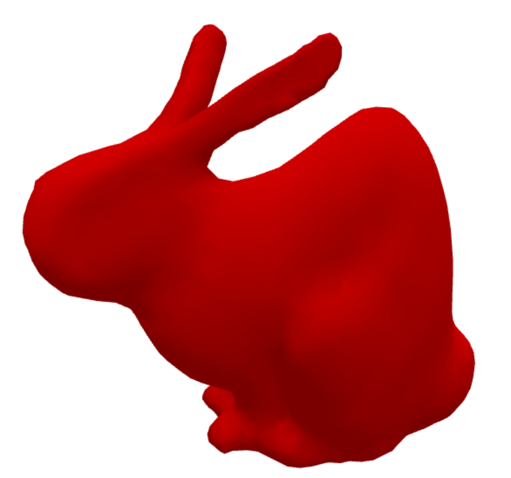

laplacian deformation demo[WIP]
=====================

[CLICK HERE FOR DEMO](https://mikolalysenko.github.io/laplacian-deformation/demo.html)

This is a demo that implements laplacian deformation in
Javascript. Laplacian deformation is a technique that allows you to
deform an arbitrary mesh as if it were a cloth-like material. In the
demo, you can grab handles on the mesh, and drag them. The vertices of
the rest of the mesh are then smoothly updated, resulting in a
deformation. The deformations produced by this technique tend to look
natural, since the general shape of the mesh is preserved. This kind
of technique is useful in 3D-modeling software.

Our implementation is based on the description by [Christopher
Tralie](http://www.ctralie.com/Teaching/LapMesh/). To solve the least
squares linear system he describes, we use our own implementation of
the [QR-decompositon](https://github.com/Erkaman/qr-solve). We also
attempted using the [Cholesky
Decompositon](https://github.com/Erkaman/cholesky-solve), and the
[Conjugate Gradient
Method](https://github.com/mikolalysenko/conjugate-gradient), however
we found that both methods had issues with numerical instability, and
thus they could not be used.

We plan to further optimize our implementation, and turn it into a
user-friendly module. Note that right now the code of the demo is
rather messy, and not very readable. It will be cleaned up soon.

# Video

