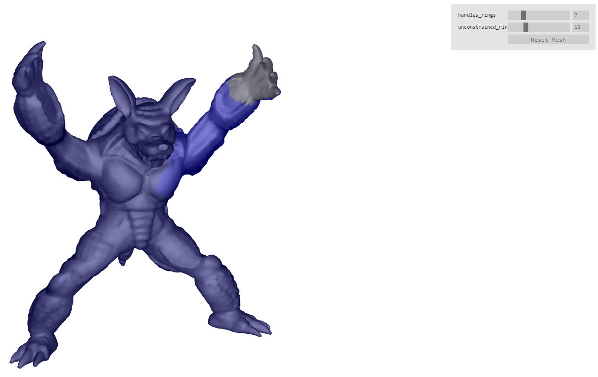
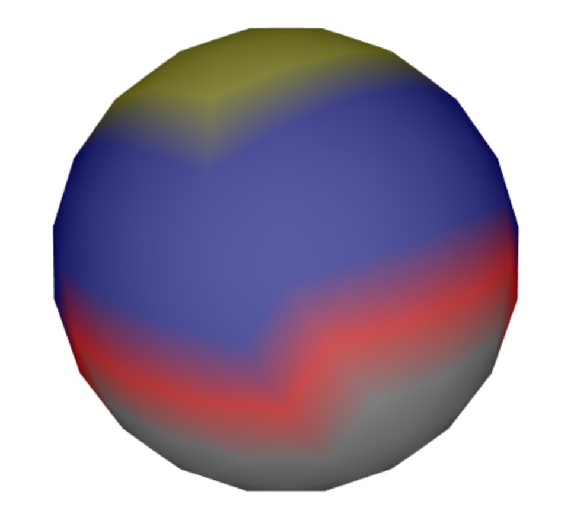
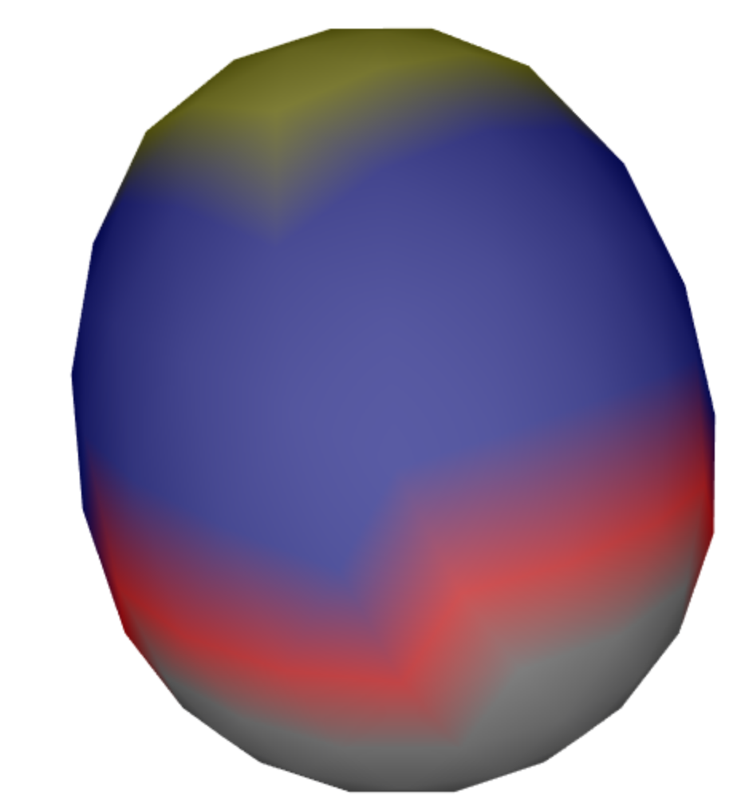

laplacian deformation module
=====================

[CLICK HERE FOR DEMO](https://mikolalysenko.github.io/laplacian-deformation/demo.html)



This module implements [laplacian surface editing](https://people.eecs.berkeley.edu/~jrs/meshpapers/SCOLARS.pdf).
This technique allows you to deform the surface of a mesh, while still preserving the details of the surface.
We implement this by minimizing the energy function (5) in the linked paper.

To run a minimal example do:

    npm run minimal

To run a more advanced demo do:

    npm run start

In our current API, we load the module as

```javascript
require("laplacian-deformation").load(function(initModule,prepareDeform, doDeform, freeModule) {
// code that uses the API here.
}
```

The API consists of four methods. We describe them below.

### `initModule(mesh)`

initializes the module for doing deformation on `mesh`. Must be called
before any other methods in the API.

### `prepareDeform(handles, unconstrained)`

Does precalculations necessary for performing deformation on a region
of vertices of the mesh. Note that this is a slow operation that
performs performs a cholesky decomposition!

* `handles` vertices that can be freely manipulated and moved by the user of the library.

* `unconstrained` these are vertices that are free, and are solved for
  in the laplacian deformation calculations.

Some images will serve to clarify the meaning of the above
parameters.



In the image, `handles` is yellow, `unconstrained` is blue, and the gray region are vertices not affected by the
deformation. Only yellow and blue vertices are affected by the deformation, so these are in the region of deformation.
Note that the user is expected to specify boundary vertices that specify the end of the region of deformation.
In the above image, these boundary vertices are the yellow vertices above the gray vertices, and these boundary
vertices are part of the `handles` vertices. So their positions can be manipulated as well. 

The user of the library deforms the mesh by setting the positions of
the `handles` vertices by calling `doDeform`. One possible
deformation can look like the below:



It is shown in `minimal/minimal.js` how this deformation was done.

### `deDeform(handlesPositions)`

After calling `prepareDeform()`, we can use `doDeform()` to specify
the positions of the `handles` vertices, and thus deform the
mesh. The function returns the vertex coordinates of the deformed mesh. We can call
this function as many times as we want after calling `prepareDeform`.
In difference to `prepareDeform`, this is a very fast operation.

* `handlesPositions` is simply an array of coordinates of the
format `[[x,y,z], [x,y,z], ...]`. The first coordinate sets the
positions of the handle `handles[0]`, and so on.
