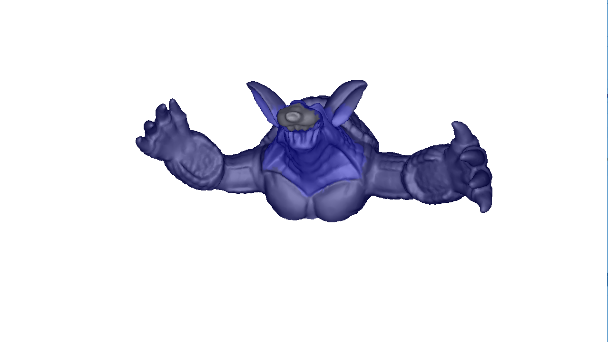

source code of laplacian_deformation.js
=====================

Here, we can find the source code behind `laplacian_deformation.js`. 
This code is the true source code of the laplacian deformation solver.
The Javascript code is basically just an interface to the solver.

The solver source code is in `laplacian_deformation.cpp`. Its only dependency is Eigen.
There are no other dependencies.

I also made a GUI application for visualizing the results of the solver. It
uses GLFW and OpenGL to create a window with an OpenGL context. The application can be 
built using CMake, with the file CMakeLists.txt. If you run the application, it should look like this:

in the application, the armadillo has been deformed so that the head of the armadillo is facing upwards.
The application doesn't actually provide an interface for deforming the mesh in the GUI. You should 
use the Javascript demo for that.

To compile the solver down to WebAssembly, run `build.bat`(or write your own script if on Linux).